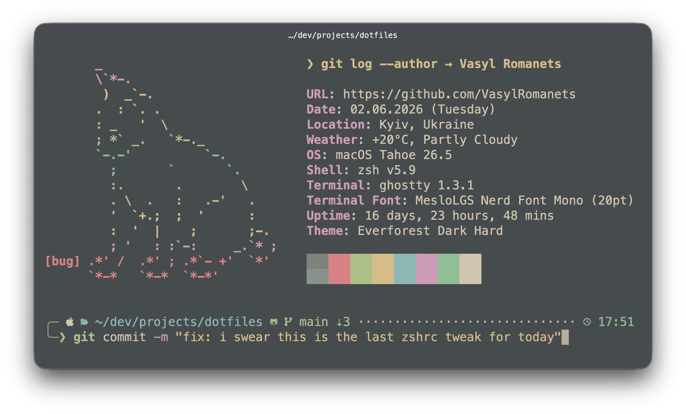

# dotfiles

> My personal dotfiles for macOS — version-controlled, XDG-compliant, and Everforest-themed.

<p align="center">
  
</p>

## Structure

> [!NOTE]
> **Real talk about XDG compliance:** This setup is as XDG-compliant as possible. However, a few stubborn tools (e.g. `SSH`, `.zshenv`) hardcode their paths and refuse to leave the `$HOME` folder.

```
dotfiles/
├── packages/
│   └── <pkg>/
│       ├── link/        # files to symlink (mirrored structure, optional)
│       ├── shell/       # <pkg>.zsh sourced from ~/.config/zsh/source/ (optional)
│       ├── copy/        # files to copy (optional)
│       └── setup.toml   # install conditions and copy/link target (optional)
└── setup/
    ├── Brewfile         # all Homebrew packages
    ├── bootstrap.zsh    # full machine setup (run once on a new Mac)
    ├── install.zsh      # symlinks packages, sources shell files, copies assets
    └── macos.zsh        # sensible macOS defaults
```

## setup.toml

Each package may optionally include a `setup.toml`. Packages without one are always processed, symlinking `link/` to `~` by default.

```toml
# Skip this package if the CLI tool/GUI app is not installed
[requires]
command = "bat"      # checked via command -v
app = "Ghostty"      # checked via /Applications/Ghostty.app

# Override symlink destination (defaults to ~)
[link]
target = "~"

# Copy files from copy/ to this directory
[copy]
target = "~/Library/..."
```

`[requires]` accepts either `command` or `app`. `[link]` is rarely needed since `~` is the default. `[copy]` is only used by packages that ship assets rather than symlinks (e.g. `coteditor`).

## New Machine Setup

> [!WARNING]
> Works on my machine! But remember, these configs are highly opinionated and hardcoded for macOS. Give the installation scripts a quick review before running them so you don't accidentally overwrite your own favorite settings.

### Prerequisites

1. Clone the repo:
```zsh
git clone https://github.com/vasylromanets/dotfiles.git ~/.dotfiles
```

2. Run the bootstrap script:
```zsh
~/.dotfiles/setup/bootstrap.zsh
```

This will:
- Install Xcode Command Line Tools
- Install Homebrew
- Install all packages from `Brewfile`
- Symlink and copy all packages via `install.zsh`

3. Apply macOS defaults (optional):
```zsh
~/.dotfiles/setup/macos.zsh
```

### Manual Steps

These can't be automated and must be done manually on each machine:

**Git identity** — create `~/.config/git/config.local`:
```ini
[user]
    name = Your Name
    email = your.name@email.com
```

**SSH** — create `~/.ssh/config.local`:
```
Host github.com
  IdentityFile ~/.ssh/your_key
```

## Updating

After adding new files to the repo, re-run:
```zsh
~/.dotfiles/setup/install.zsh
```

## Appearance

* **Theme:** Most tools are themed with [Everforest Dark Hard](https://github.com/sainnhe/everforest) for a warm, low-fatigue aesthetic.
* **Font:** The terminal and editors use [Meslo LG Nerd Font Mono](https://github.com/ryanoasis/nerd-fonts/tree/master/patched-fonts/Meslo).

## Inspiration

Many thanks to the dotfiles community for sharing their insights and configurations over the years.
