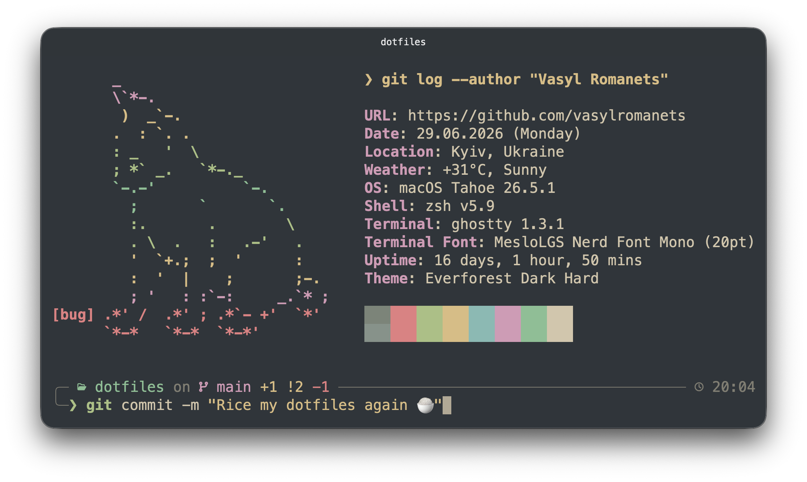
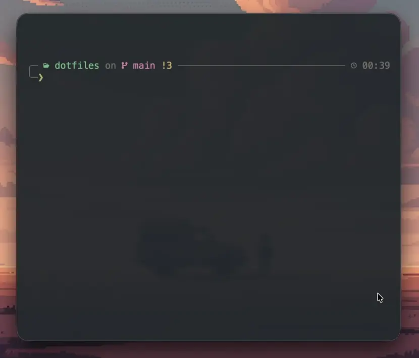

# dotfiles

> My personal macOS dotfiles crafted with love - version-controlled, Everforest-themed, XDG-compliant where possible.

<p align="center">
  
</p>

## Structure

```
dotfiles/
├── packages/
│   └── <pkg>/
│       ├── link/        # files to symlink (mirrored structure, optional)
│       ├── shell/       # <pkg>.zsh sourced from ~/.config/zsh/source/ (optional)
│       ├── copy/        # files to copy (optional)
│       └── setup.toml   # install conditions and copy/link target (optional)
└── setup/
    ├── _lib.zsh         # shared utilities (colors, logging)
    ├── Brewfile         # Homebrew formulae, casks, mas apps and vscode extensions
    ├── bootstrap.zsh    # full machine setup
    ├── sync.zsh         # symlinks dotfiles and copies assets
    └── macos.zsh        # sensible macOS defaults
```

## setup.toml

Each package may optionally include a `setup.toml`. Packages without one are always processed, symlinking `link/` to `~` by default.

```toml
# Skip this package if the CLI tool/GUI app is not installed
[requires]
command = "bat"      # checked via command -v
app = "Ghostty"      # checked via /Applications/Ghostty.app

# Override symlink destination (defaults to ~)
[link]
target = "~"

# Copy files from copy/ to this directory
[copy]
target = "~/Library/..."
```

`[requires]` accepts `command`, `app`, or both. `[link]` is rarely needed since `~` is the default. `[copy]` is only used by packages that can't be symlinked because of macOS sandboxing (e.g. `coteditor`).

## New Machine Setup

> [!WARNING]
> Works on my machine! Review the installation scripts and dotfiles before adopting.

1. Clone the repo:
```zsh
git clone https://github.com/vasylromanets/dotfiles.git ~/.dotfiles
```

2. Run the bootstrap script:
```zsh
~/.dotfiles/setup/bootstrap.zsh
# or: cd ~/.dotfiles && make bootstrap
```

<p align="center">
  
</p>

This will:
- Install Xcode Command Line Tools
- Install Homebrew
- Install formulae, casks, App Store apps and VS Code extensions from Brewfile
- Symlink dotfiles and copy assets
- Configure Git and SSH
- Apply macOS defaults

You'll be prompted before each step.

## Updating

After adding or modifying dotfiles, re-run `sync.zsh` to apply them:
```zsh
~/.dotfiles/setup/sync.zsh
# or: cd ~/.dotfiles && make sync
```

## Appearance

* **Theme:** Most tools are themed with [Everforest Dark Hard](https://github.com/sainnhe/everforest) for a warm, low-fatigue aesthetic.
* **Font:** The terminal and editors use [Meslo LG Nerd Font Mono](https://github.com/ryanoasis/nerd-fonts/tree/master/patched-fonts/Meslo).

## Credits

Many thanks to the [dotfiles community](https://github.com/topics/dotfiles) for sharing their insights and configurations over the years.

`setup/bootstrap.zsh` is based on [Denys Dovhan's bootstrap.sh](https://github.com/denysdovhan/dotfiles/blob/master/scripts/bootstrap.sh).

`setup/macos.zsh` is inspired by [Mathias Bynens' .macos](https://github.com/mathiasbynens/dotfiles/blob/main/.macos).
