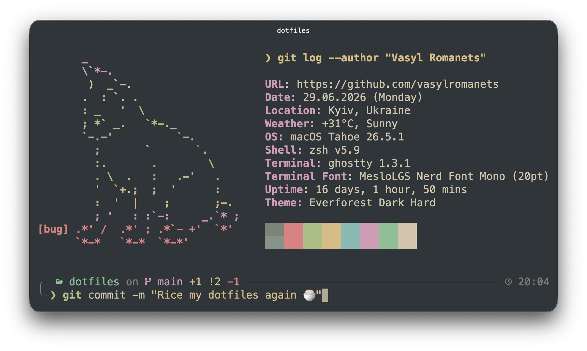
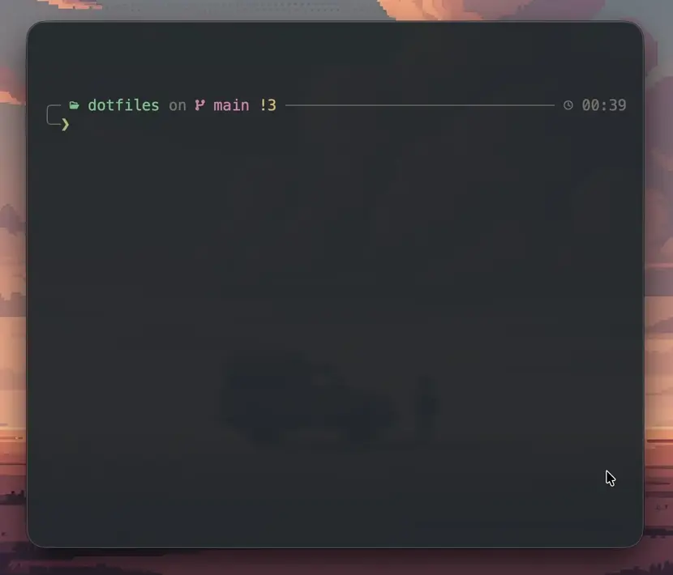

# dotfiles

My personal macOS dotfiles crafted with love.

<p align="center">
  
</p>

## Structure

```
dotfiles/
├── packages/
│   └── <pkg>/
│       ├── link/          # files to symlink (mirrored structure, optional)
│       ├── source/        # <pkg>.zsh sourced from ~/.config/zsh/source/ (optional)
│       ├── copy/          # files to copy (optional)
│       ├── hooks/         # pre-setup.zsh / post-setup.zsh run by sync.zsh, theme-changed.zsh run by theme (optional)
│       ├── templates/     # Mustache templates dots build-themes renders per scheme (optional)
│       └── setup.toml     # install conditions and copy/link target (optional)
└── setup/
    ├── _lib.zsh           # shared utilities (colors, logging)
    ├── Brewfile           # Homebrew formulae, casks, cargo crates, mas apps, and vscode extensions
    ├── bootstrap.zsh      # full machine setup
    ├── sync.zsh           # symlinks package files and copies assets
    ├── build-themes.zsh   # renders every theme's per-tool files from packages/theme/schemes
    ├── prune-symlinks.zsh # removes orphaned symlinks left by renamed/removed package files
    └── macos.zsh          # sensible macOS defaults
```

## New Machine Setup

> [!WARNING]
> Works on my machine! Review the installation scripts and package files before adopting.

1. Clone the repo:
```zsh
git clone https://github.com/vasylromanets/dotfiles.git ~/.dotfiles
```

2. Run the bootstrap script:
```zsh
~/.dotfiles/setup/bootstrap.zsh
```

<p align="center">
  
</p>

This will:
- Install Xcode Command Line Tools
- Install Homebrew
- Install formulae, casks, cargo crates, App Store apps, and VS Code extensions from Brewfile
- Symlink package files and copy assets
- Configure Git and SSH
- Apply macOS defaults

You'll be prompted before each step.

## Updating

Once the bootstrap has run, everything is available through the `dots` command (`dots help` lists it). After adding or modifying package files, apply them with:
```zsh
dots sync
```

Renaming or removing a package file can leave a stale symlink behind. Run `dots prune-symlinks` occasionally to clean those up.

## Package Setup

Each package may optionally include a `setup.toml`. Packages without one are always processed, symlinking `link/` to `~` by default.

```toml
# Skip this package if the CLI tool/GUI app is not installed
[requires]
command = "bat" # checked via command -v
app = "Ghostty" # checked via /Applications/Ghostty.app

# Override symlink destination (defaults to ~)
[link]
target = "~"

# Copy files from copy/ to this directory
[copy]
target = "~/Library/..."
```

`[requires]` accepts `command`, `app`, or both. `[link]` is rarely needed since `~` is the default. `[copy]` is only used by packages that can't be symlinked because of macOS sandboxing (e.g. any app installed from the Mac App Store).

A package can also define `hooks/pre-setup.zsh` and/or `hooks/post-setup.zsh` for setup steps beyond symlinking/copying (e.g. resolving plugin dependencies). Both are optional and run only for packages that pass `[requires]`.

## Themes

`theme` switches the theme across Ghostty, bat, delta, fzf, micro, vivid, yazi and `ls`/eza colors. Each theme is one [Tinted8](https://github.com/tinted-theming/home/tree/main/specs/tinted8) scheme in `packages/theme/schemes`; `dots build-themes` renders the per-tool files from it (needs [`tinted-builder-rust`](https://github.com/tinted-theming/tinted-builder-rust) 0.21.x) and the results are committed, so a normal `dots sync` doesn't need the builder.

## Credits

Many thanks to the [dotfiles community](https://github.com/topics/dotfiles) for sharing their insights and configurations over the years.

`setup/bootstrap.zsh` is based on [Denys Dovhan's bootstrap.sh](https://github.com/denysdovhan/dotfiles/blob/master/scripts/bootstrap.sh).

`setup/macos.zsh` is inspired by [Mathias Bynens' .macos](https://github.com/mathiasbynens/dotfiles/blob/main/.macos).
